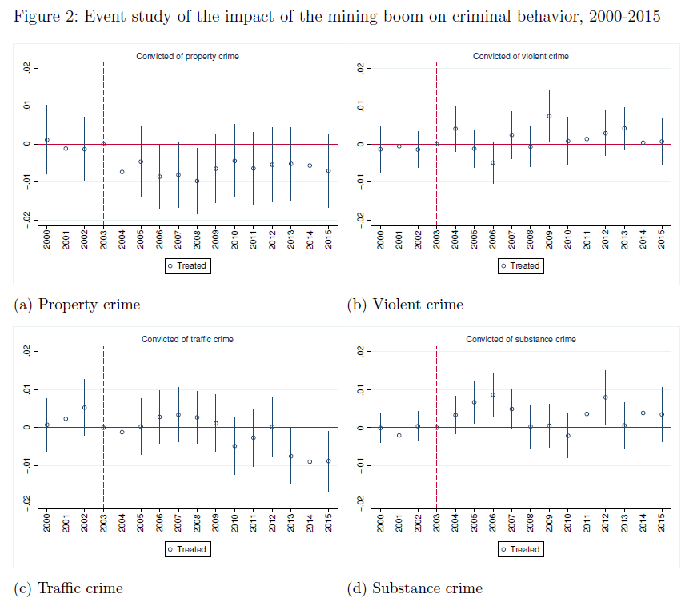

##### Download

+ [Paper](/jmp.pdf)

---

##### Abstract

This paper studies how a positive local labor market shock affects criminal behavior. I exploit the 2004 iron ore boom in Northern Sweden as an exogenous shock to local economic conditions, combining geocoded administrative data on all criminal convictions and demographics for 2000–2015 with a difference-in-differences design. Comparing young male residents of mining municipalities to those of similar nearby municipalities, I identify the causal impact of improved labor market opportunities on crime, and characterize treatment effect heterogeneity using causal forests. The boom led to a 52 percent decline in property crime convictions among young male residents aged 18–29 (from a baseline rate of 1.2 percent), concentrated within 20 kilometers of the mines and driven primarily by first-time offenders. In contrast, substance-related crime convictions increased by 181 percent (from a baseline of 0.2 percent), particularly among repeat offenders and individuals directly employed in the mining sector. Violent and traffic crimes are unaffected. Mechanism analysis shows the boom substantially improved local employment and earnings, while migration patterns, policing intensity, and income inequality do not account for the results. The findings show that positive labor market shocks can simultaneously reduce economically motivated crime and increase consumption-driven offenses.

---

##### Figure 2: Event study of the impact of the mining boom on criminal behavior, 2000–2015

---

##### Citation

Rodríguez-Puello, Gabriel. 2026. "Digging for Trouble? Mining and Criminal Behavior of Young Males." Working paper.
