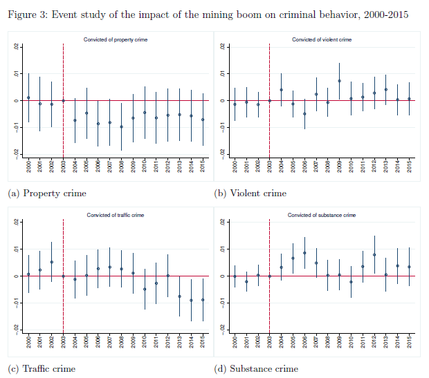

##### Download

+ [Paper](/jmp.pdf)

---

Listen to a NotebookLM-generated podcast:

<audio controls src="/podcasts/paper1-podcast.m4a" style="width:100%;max-width:500px;"></audio>

---

##### Abstract

This paper studies how a large, positive local economic shock affects criminal behavior. Better labor market opportunities raise the opportunity cost of crime, but higher incomes also relax the budget constraint for drugs and alcohol. I study both forces using the 2004 iron ore boom in northern Sweden, combining geocoded administrative data on all criminal convictions with a difference-in-differences design and causal forests. Among men aged 18–29 in mining municipalities, property crime convictions fall by 0.66 percentage points from a baseline of 1.25 percent (52 percent), concentrated among those with a prior conviction. Substance-related convictions rise by 0.46 percentage points from a baseline of 0.25 percent (181 percent), especially among prior offenders and workers in mining and manufacturing. Violent and traffic crimes are unaffected. The boom raised employment and earnings, while migration, policing, and income inequality do not explain the results. Local economic booms can reduce crime, but part of the gain is offset by a shift toward substance-related offending.

---

##### Figure 2: Event study of the impact of the mining boom on criminal behavior, 2000–2015

---

##### Citation

Rodríguez-Puello, Gabriel. 2026. "Digging for Trouble? Mining and Criminal Behavior of Young Males." Working paper.
