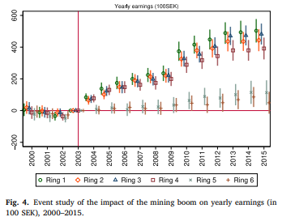

##### Download

+ [Published paper](https://doi.org/10.1016/j.labeco.2026.102879)

---

Listen to a NotebookLM-generated podcast:

<audio controls src="/podcasts/paper2-podcast.m4a" style="width:100%;max-width:500px;"></audio>

---

##### Abstract

This paper examines how the labor market effects of an economic shock diffuse across space and sectors, and how these effects vary across individual characteristics and for migrants. We exploit the mining boom in Northern Sweden triggered by the unexpected increase in international resource prices in 2004, using geocoded individual-level administrative data and dynamic difference-in-differences specifications. We find consistent positive effects of the mining boom on earnings that extend up to 27 km from the mines during the first boom years and up to 83 km in subsequent years. We find particularly large gains in earnings and employment for residents directly employed in the mining sector, as well as significant positive earnings spillover effects in other sectors such as manufacturing, construction, and services. At the same time, the service sector experiences negative employment effects, consistent with a dominant resource movement effect relative to the local spending effect: the expanding mining sector draws workers away from other activities in a context of limited local labor supply. Finally, we find significant in-migration of young, unmarried, and highly educated individuals to mining areas, who benefit from the boom in terms of earnings and employment; this is especially true for migrants who relocate to work directly in the mining sector.

---

##### Figure 4: Event study of the impact of the mining boom on yearly earnings, 2000–2015



---

##### Citation

Rodríguez-Puello, Gabriel, and Jonna Rickardsson. 2026. "Diffusion of Economic Shocks in the Labor Market: Evidence from a Mining Boom." *Labour Economics* 100: 102879.

```latex
@article{rodriguez2026diffusion,
  author  = {Rodr\'iguez-Puello, Gabriel and Rickardsson, Jonna},
  year    = {2026},
  title   = {Diffusion of Economic Shocks in the Labor Market: Evidence from a Mining Boom},
  journal = {Labour Economics},
  volume  = {100},
  pages   = {102879},
  doi     = {10.1016/j.labeco.2026.102879}}
```
