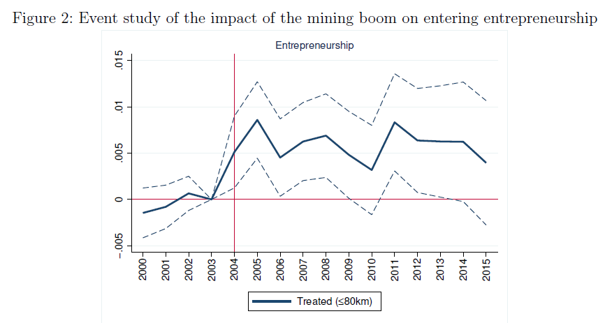

##### Abstract

This paper examines how local economic shocks affect entrepreneurship, considering entry (extensive margin) and performance of existing entrepreneurs and their firms (intensive margin). Exploiting Sweden's 2004 mining boom as an exogenous shock, we use administrative data (2000–2015) and difference-in-differences estimates comparing individuals within 80 km of a mine to those 80–150 km away. The boom increased entrepreneurial entry but not the number of new firms, as many entrants were hybrid entrepreneurs reallocating effort to existing ventures. Incumbents gained through higher capital income and lower exit risk, while treated firms expanded employment and wage costs without improving operating profits.

---

##### Figure 2: Event study of the impact of the mining boom on entering entrepreneurship

---

##### Authors

Gabriel Rodríguez-Puello (Jönköping International Business School) and Orsa Kekezi (Institute for Social Research, SOFI)
