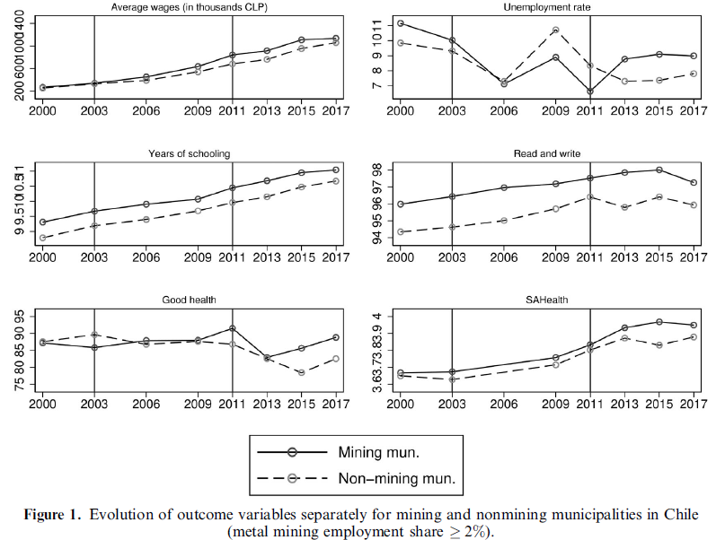

##### Download

+ [Published paper](https://doi.org/10.1080/00220388.2024.2440793)

---

##### Abstract

This paper evaluates the local effects of an economic shock, namely the metal mining price supercycle, on individuals' socioeconomic well-being in Chilean municipalities. The empirical approach is based on the differential exposure of municipalities to the shock and the world prices of minerals. I use the Chilean National Socioeconomic Characterization Survey for the period 2000–2017. The paper focuses on three dimensions of socioeconomic well-being: economic well-being (wages and unemployment), human capital (schooling and the ability to read and write), and health (good health and self-assessed). The mining sector is composed predominantly of young individuals and males; therefore, I also analyze the observed heterogeneity by performing estimations focusing on youth and gender. I find that the mining price shock affects economic-related indicators such as wages and unemployment. The shock increases wages and reduces unemployment rates in mining municipalities compared to nonmining municipalities. The reduction in unemployment rates is concentrated among males. Moreover, schooling is positively affected, especially for young individuals. The shock has no significant effect on health and the estimates are precise enough to rule out large effects of the mining boom on health.

---

##### Figure 1: Evolution of outcome variables for mining and non-mining municipalities in Chile



---

##### Citation

Rodríguez-Puello, Gabriel. 2025. "Socioeconomic Well-Being in the Face of Commodity Price Shocks: Evidence from Chile." *The Journal of Development Studies* 61 (7): 1081–1109.

```latex
@article{RP25jds,
author  = {Gabriel Rodr\'iguez-Puello},
year    = {2025},
title   = {Socioeconomic Well-Being in the Face of Commodity Price Shocks: Evidence from Chile},
journal = {The Journal of Development Studies},
volume  = {61},
number  = {7},
pages   = {1081--1109},
doi     = {10.1080/00220388.2024.2440793}}
```
