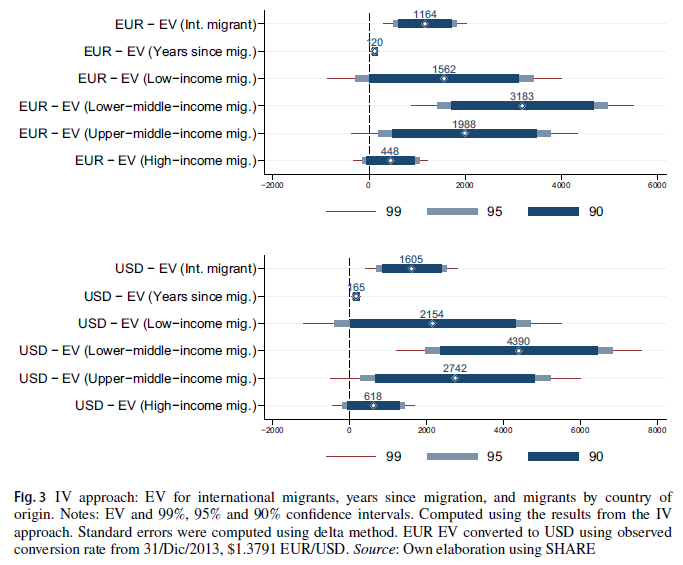

##### Download

+ [Published paper](https://doi.org/10.1007/s10902-025-00916-1)

---

##### Abstract

People often move internationally to improve their personal situation. Yet, integration into the host society can be challenging and have negative immediate consequences on individuals' well-being. This paper explores the relationship between international migration and subjective well-being for a sample of European individuals. We use an instrumental variable panel data approach to estimate the monetary cost of individuals' well-being post-migration. Specifically, we estimate the average cost an individual is willing to bear to accept the potential negative effects of international migration on their well-being. Our results reveal a negative relationship between international migration and subjective well-being. Our estimates suggest that an average migrant is willing to accept an increase of EUR 1,164 (roughly USD 1,605) in their monthly overall income to migrate across international borders and endure a negative impact on their well-being as captured by their level of life satisfaction. This negative association is particularly pronounced the more years since migration and among those from lower-middle-income countries. Our work highlights the importance of studying the determinants of well-being for individuals and contributes evidence to inform policies seeking to improve the local conditions of recent migrants and their adaptation to the new environment.

---

##### Figure 3: IV estimates of the equivalent variation for international migrants by country of origin

---

##### Citation

Rodríguez-Puello, Gabriel, Leonidas Hernandez, Diana Romero-Espinosa, and Francisco Rowe. 2025. "The Disruptive Long-Term Costs of International Migration on Subjective Well-Being." *Journal of Happiness Studies*, Forthcoming.
