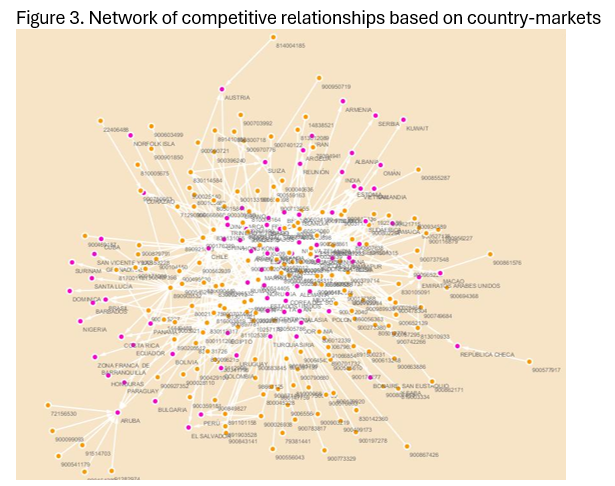

Listen to a NotebookLM-generated podcast:

<audio controls src="/podcasts/paper6-podcast.m4a" style="width:100%;max-width:500px;"></audio>

---

##### Abstract

While the competitive environment is a well-known determinant of export pricing, little is known about how the properties of competitive relationships shape a firm's pricing power. This study investigates the duality of competition networks effects, conceptualizing pricing power as two-faceted ability consisting of, first, the capacity to command price premiums and, second, its ability to resist vulnerability to global shocks. We bridge multimarket competition and social network theory to propose that competitive network position acts through bonding and transmission mechanisms. Using transaction-level data on exporters' sales and a two-stage empirical approach, combining vector autoregression to estimate price transmission elasticities with social network analysis, we find that competition network position is a contradictory determinant of performance. While network density facilitates price premiums through bonding and relational constraint, it simultaneously increases responsiveness to international price volatility. In contrast, network centrality creates a liability of visibility, as central firms face high structural exposure that forces rapid price transmission without conferring the benefit of premiums. These findings contribute to international marketing literature by refining the boundary conditions of multimarket competition theory and introducing a framework for strategic network management, offering managers a structural lens to face the premium-volatility trade-off across multi-arena competitive landscapes.

---

##### Figure 3: Network of competitive relationships based on country-markets

---

##### Authors

Luis Miguel Bolivar (EAFIT University), Gabriel Rodríguez-Puello (Jönköping International Business School), and Miguel Gómez (Cornell University)
