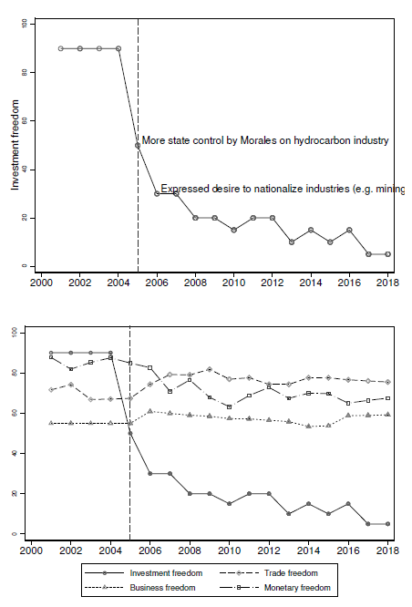

Listen to a NotebookLM-generated podcast:

<audio controls src="/podcasts/paper7-podcast.m4a" style="width:100%;max-width:500px;"></audio>

---

##### Abstract

This paper examines how investment freedom affects mining of non-renewable raw materials, measured as mineral production, across developing countries, using a new mine-level dataset covering over 30 (critical) raw minerals from 2000 to 2018. We link country-level indicators of investment freedom to mine-level output, and use rich fixed effects and an instrumental variables strategy that exploits regional waves of democratization to identify effects. Our results show that greater investment freedom leads to significantly higher production, consistent with the idea that better institutional conditions reduce capital risk and encourage productive investment. Specifically, we find that a standard deviation increase in investment freedom generates a 53% increase in mine production. However, the positive effect of investment freedom is attenuated to zero for mines producing critical raw minerals, suggesting that the high strategic value and (future) rents associated with these minerals compensate for institutional risk. Second, we document that the positive impact of investment freedom is independently weaker at higher mineral price levels. Both results point to a unified pattern: when the value of mineral extraction is high, whether through strategic designation or (future) market prices, firms are less sensitive to institutional conditions.

---

##### Investment freedom and institutional change in Bolivia, 2000–2018

---

##### Authors

Steven Poelhekke (Vrije Universiteit Amsterdam and CEPR) and Gabriel Rodríguez-Puello (Jönköping International Business School)
