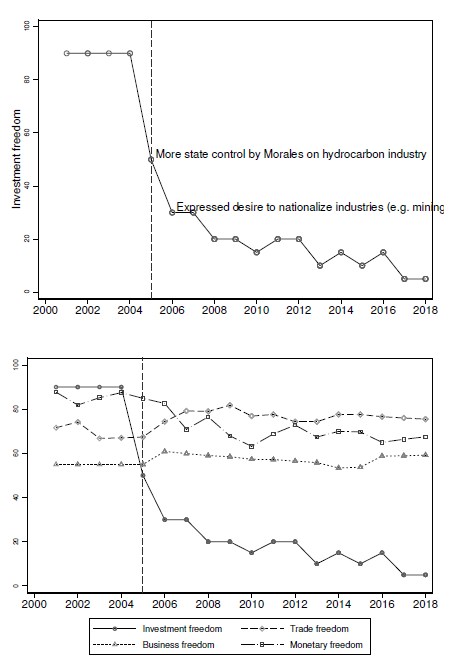

Listen to a NotebookLM-generated podcast:

<audio controls src="/podcasts/paper7-podcast.m4a" style="width:100%;max-width:500px;"></audio>

---

##### Abstract

Expanding the supply of minerals is critical for investment into affordable renewable energy and for achieving climate goals. Can institutional reform contribute meaningfully to increasing mining output in the short run? This paper examines how investment freedom affects mining output of non-renewable raw materials across developing countries, using a new mine-level dataset covering over 30 (critical) raw minerals from 2000 to 2018. Using an instrumental variables strategy that exploits regional waves of democratization and rich fixed effects to identify effects, we find that greater investment freedom leads to significantly higher mineral production: a within-standard-deviation increase in investment freedom generates a 22% increase in mine production. However, the effect is attenuated to zero for mines producing critical raw minerals, suggesting that the high strategic value and (future) rents associated with these minerals compensate for institutional risk. Second, higher current mineral prices also attenuate the importance of investment freedom. Both results point to a unified pattern: firms are less sensitive to institutional risk when the (expected) value of mineral extraction is high.

---

##### Investment freedom and institutional change in Bolivia, 2000–2018

---

##### Authors

Steven Poelhekke (Vrije Universiteit Amsterdam and CEPR) and Gabriel Rodríguez-Puello (Jönköping International Business School)
