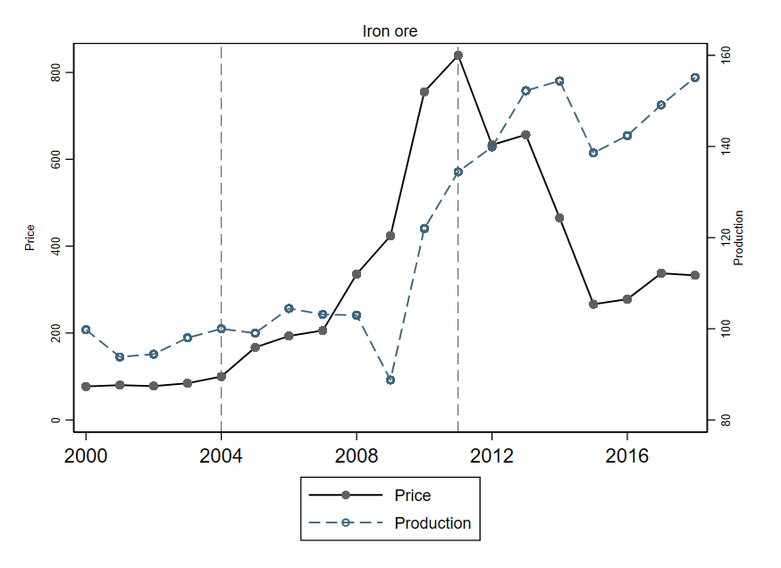

##### Abstract

We study how the 2004 iron ore price boom in Northern Sweden affected family formation among adults aged 18–35. Using geocoded administrative panel data and a difference-in-differences design exploiting spatial variation in proximity to mines, we find that the boom increased fertility and cohabitation entry but had no effect on formal marriage, while divorce rates rose, driven primarily by women. Fertility effects are comparable across genders, consistent with Sweden's generous parental leave attenuating the substitution effect on female labor supply. Divorce is concentrated among older women already in established partnerships, consistent with improved economic independence enabling exit from unsatisfactory relationships. Treatment effects build gradually and persist beyond the boom.

---

##### Iron ore price and production in Northern Sweden, 2000–2019

---

##### Authors

Gabriel Rodríguez-Puello (Jönköping International Business School) and Paul Nystedt (Jönköping International Business School)
